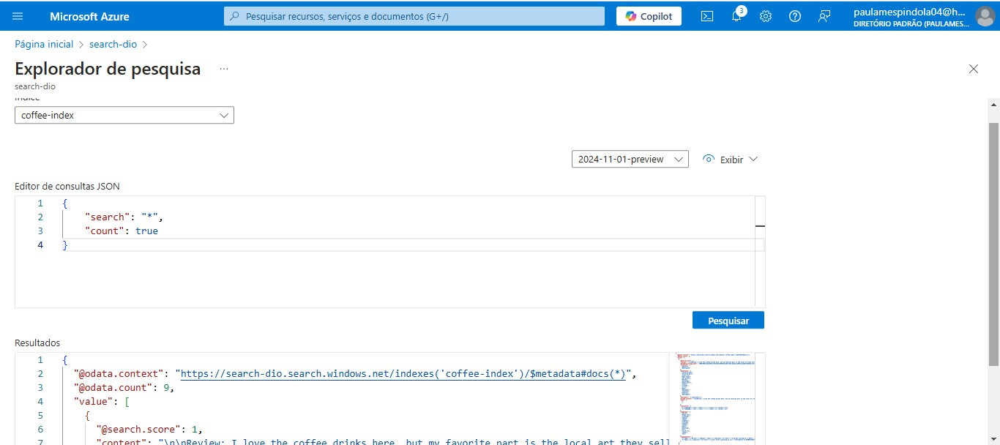
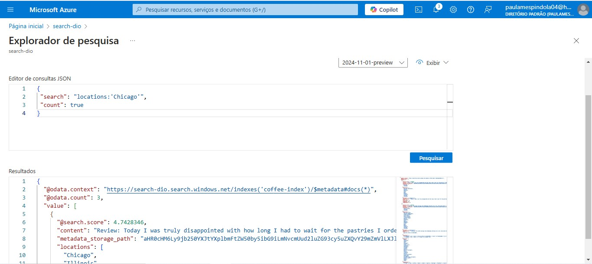
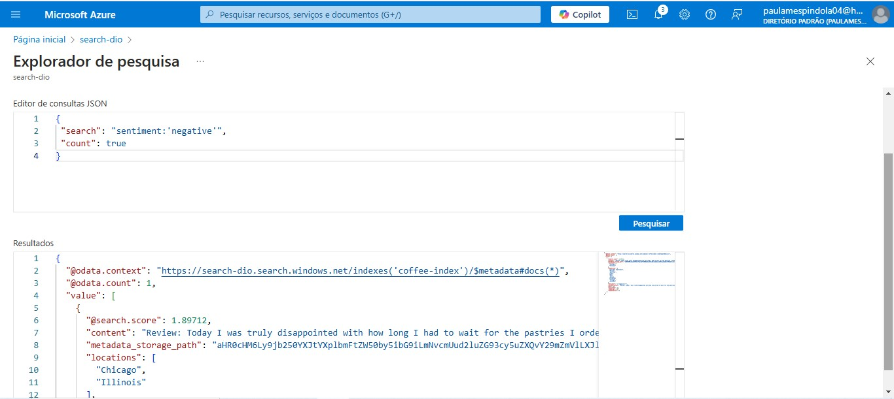

# ☕ Fourth Coffee - Índice de Pesquisa do Azure AI

## Sobre o Projeto
Hey! 👋 Bem-vindo ao meu projeto de índice de pesquisa para a Fourth Coffee! Aqui, estou explorando o incrível mundo do Azure AI para extrair insights das avaliações dos clientes. A ideia é usar a tecnologia para entender melhor o que os clientes estão dizendo e, quem sabe, fazer algumas melhorias no café! ☕✨

## Recursos do Azure
Para transformar essa ideia em realidade, eu criei alguns recursos super legais no Azure:

- **Azure AI Search**: O coração da nossa pesquisa! Ele cuida da indexação e das consultas.
- **Azure AI Services**: Adiciona um toque de magia com insights gerados por IA.
- **Conta de Armazenamento do Azure**: Onde guardamos todas as nossas preciosas avaliações.

## Como Configurar Tudo

### 1. Criar Recursos no Azure
Primeiro, vamos criar alguns recursos. No portal do Azure, siga esses passos:

- **Azure AI Search**:
  - Nome do serviço: `nome-unico`
  - Localização: `East US 2`
  - Nível de preço: `Básico`

- **Azure AI Services**:
  - Nome: `nome-unico`
  - Mesma localização do Azure AI Search
  - Nível de preço: `Standard S0`

- **Conta de Armazenamento do Azure**:
  - Nome: `nome-unico`
  - Mesma localização
  - Desempenho: `Padrão`
  - Redundância: `LRS`

### 2. Carregar Documentos
Vamos colocar algumas avaliações para análise! Crie um contêiner chamado `coffee-reviews` com acesso público no armazenamento do Azure. Depois, baixe e extraia as avaliações de café [aqui](https://aka.ms/mslearn-coffee-reviews) e carregue os arquivos no contêiner. 🥳

### 3. Indexar os Documentos
Agora, a parte divertida! Vá até o seu recurso do Azure AI Search e use o assistente de Importar dados. Conecte-se ao Azure Blob Storage, escolha o contêiner `coffee-reviews` e anexe o recurso de serviços de IA. Vamos enriquecer esses dados! 🌟

### 4. Consultar o Índice
Hora de ver os resultados! Use o Search Explorer para realizar consultas. Aqui vão alguns exemplos de como testar:

- Para buscar todos os documentos:

  ```json
  {
      "search": "*",
      "count": true
  }

 

- Para filtrar por localização:

```json
Copiar
{
    "search": "locations:'Chicago'",
    "count": true
}
```

 

- Para ver as avaliações negativas:

```json
Copiar
{
    "search": "sentiment:'negative'",
    "count": true
}
```

 

## Insights e Aprendizados
Uau, essa jornada foi cheia de aprendizados! 🚀 Aqui estão algumas das minhas descobertas:

* Análise de Sentimentos: Entender o que os clientes realmente pensam pode fazer toda a diferença! As avaliações negativas geralmente têm motivos específicos que podemos resolver.
* Poder das Habilidades Cognitivas: Usar IA para extrair informações é como ter um superpoder! Fiquei impressionada com o quanto podemos descobrir rapidamente.
* Integração de Serviços: Aprendi que juntar tudo no Azure não é só uma boa ideia, é essencial! Isso me deixou super animada para criar soluções mais complexas no futuro.
* Desenvolvimento Pessoal: Essa experiência me deixou mais confiante em trabalhar com dados e explorar novas tecnologias. Mal posso esperar para aplicar tudo isso em projetos reais!
